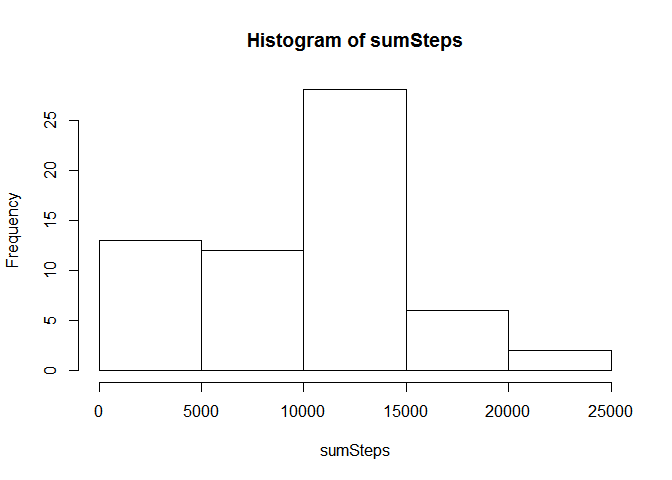
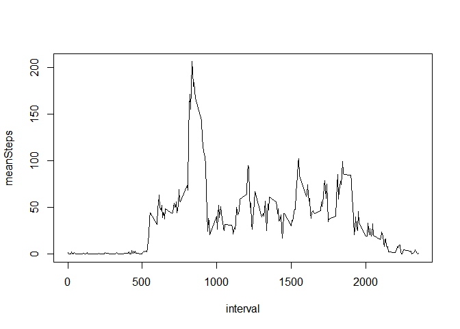
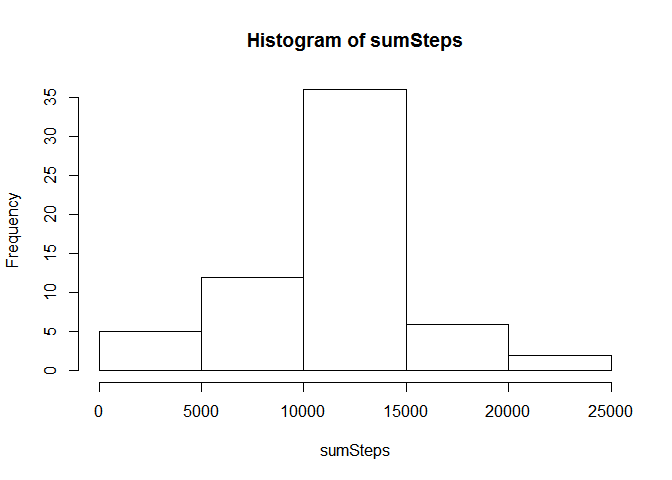
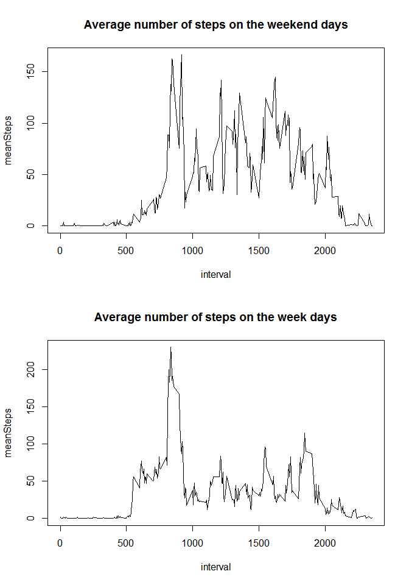

# Reproducible Research: Peer Assessment 1

## Loading and preprocessing the data


```r
options(scipen = 1)
Sys.setlocale("LC_TIME", "English")
```

```
## [1] "English_United States.1252"
```

In this section, I will simply load the data in R and convert the dataframe into a data.table.


```r
library(data.table)
```

```
## Warning: package 'data.table' was built under R version 3.1.2
```

```r
# Location of the files in your working directory
location.csv = "./activity.csv";
location.zip = "./activity.zip"

# If you don't have the .csv or the .zip file
if (!file.exists(location.zip) & !file.exists(location.csv)) {
    URL <- "https://d396qusza40orc.cloudfront.net/repdata%2Fdata%2Factivity.zip"
    
    # Download the .zip
    download.file(URL, destfile=location.zip)    
}

# If you have the .zip but not the .csv
if (!file.exists(location.csv)) {
    
    # Unzip the .zip
    unzip(location.zip)
}

# Reading the data
activity <- read.csv("./activity.csv")

# Converting the column date into something usable
activity$date <- as.Date(activity$date)

# Converting the data frame into a data.table for easier and faster manipulation
activity <- data.table(activity)

# Print the resulting dataset
activity
```

```
##        steps       date interval
##     1:    NA 2012-10-01        0
##     2:    NA 2012-10-01        5
##     3:    NA 2012-10-01       10
##     4:    NA 2012-10-01       15
##     5:    NA 2012-10-01       20
##    ---                          
## 17564:    NA 2012-11-30     2335
## 17565:    NA 2012-11-30     2340
## 17566:    NA 2012-11-30     2345
## 17567:    NA 2012-11-30     2350
## 17568:    NA 2012-11-30     2355
```


## What is mean total number of steps taken per day?

In this part I will sum all the steps for each date and calculate the mean and the median of all thoses values.


```r
# Sum all the steps for each day
sumPerDay <- activity[, list(sumSteps=sum(steps, na.rm=T)), by=date]

# Make a histogram from this dataset
with(sumPerDay, hist(sumSteps))
```

 

```r
# Calculate the mean number of steps in a day
meanPerDay <- sumPerDay[,mean(sumSteps, na.rm=T)]

# Calculate the median number of steps in a day
medianPerDay <- sumPerDay[,median(sumSteps, na.rm=T)]

# Print the values
meanPerDay; medianPerDay
```

```
## [1] 9354.23
```

```
## [1] 10395
```

The mean number of steps taken per day is **9354**.

The median number of steps taken per day is **10395**.


## What is the average daily activity pattern?

To anwswer this question, I will calculate the mean number of steps for each interval and plot it.


```r
# Take the mean number of steps for each interval
meanPerInterval <- activity[, list(meanSteps=mean(steps, na.rm=T)), by=interval]

# Plot the result
with(meanPerInterval, plot(interval, meanSteps, type="l"))
```

 

```r
# Find the max interval
maxInterval <- meanPerInterval$interval[which.max(meanPerInterval$meanSteps)]

# Print the max interval
maxInterval
```

```
## [1] 835
```

The 5-min interval which contains the maximum number of step is **835**
(between 13h 55 and
13h 59).


## Imputing missing values

In order to imput missings values, we will first ignore the NA to calculate the mean number of step for each interval. Then, we will go over each missing value and imput the rounded number of step for that particular interval.


```r
# Find which values are missing
nas <- is.na(activity$steps)

# Make a copy of the original dataset
activity2 <- copy(activity)

# Calculate the mean number of steps for each interval in a new column (in the same dataset)
activity2[, meanSteps:=mean(steps, na.rm=T), by=interval]
```

```
##        steps       date interval meanSteps
##     1:    NA 2012-10-01        0 1.7169811
##     2:    NA 2012-10-01        5 0.3396226
##     3:    NA 2012-10-01       10 0.1320755
##     4:    NA 2012-10-01       15 0.1509434
##     5:    NA 2012-10-01       20 0.0754717
##    ---                                    
## 17564:    NA 2012-11-30     2335 4.6981132
## 17565:    NA 2012-11-30     2340 3.3018868
## 17566:    NA 2012-11-30     2345 0.6415094
## 17567:    NA 2012-11-30     2350 0.2264151
## 17568:    NA 2012-11-30     2355 1.0754717
```

```r
# For each missing value, take the rounded value of the mean step for this interval
activity2[nas, steps:=as.integer(round(meanSteps))]
```

```
##        steps       date interval meanSteps
##     1:     2 2012-10-01        0 1.7169811
##     2:     0 2012-10-01        5 0.3396226
##     3:     0 2012-10-01       10 0.1320755
##     4:     0 2012-10-01       15 0.1509434
##     5:     0 2012-10-01       20 0.0754717
##    ---                                    
## 17564:     5 2012-11-30     2335 4.6981132
## 17565:     3 2012-11-30     2340 3.3018868
## 17566:     1 2012-11-30     2345 0.6415094
## 17567:     0 2012-11-30     2350 0.2264151
## 17568:     1 2012-11-30     2355 1.0754717
```

```r
# Calculate the sum of steps for each date
sumPerDay2 <- activity2[, list(sumSteps=sum(steps)), by=date]

# Make a histogramm
with(sumPerDay2, hist(sumSteps))
```

 

```r
# Calculate the mean number of steps in a day
meanPerDay2 <- sumPerDay2[,mean(sumSteps)]

# Calculate the median number of steps in a day
medianPerDay2 <- sumPerDay2[,median(sumSteps)]

sum(nas); meanPerDay2; medianPerDay2
```

```
## [1] 2304
```

```
## [1] 10765.64
```

```
## [1] 10762
```

There were **2304** missing values in the first dataset.

The adjusted mean number of steps taken per day is **10766** 
(the unajusted value was 9354).

The adjusted median number of steps taken per day is **10762**
(the unajusted value was 10395).

There are differences between the theses values because in the first part of the assignment the NA were counting as 0 steps. Imputing values for the missing ones allows us to have a better estimate of the total daily number of steps. 


## Are there differences in activity patterns between weekdays and weekends?

To anwswer this last question, I will calculate the mean number of steps for each interval on the weekend and the weekdays. Then I will plot the result in a panel plot.


```r
# Which days are weekend
WE <- c("Saturday", "Sunday")

# Create a new factor variable based on the date : If the day is a weekend day, assign the value "weekend", if the day is a week day assign the value "weekday"
activity2[,day := as.factor(ifelse(weekdays(date) %in% WE, "weekend", "weekday"))]
```

```
##        steps       date interval meanSteps     day
##     1:     2 2012-10-01        0 1.7169811 weekday
##     2:     0 2012-10-01        5 0.3396226 weekday
##     3:     0 2012-10-01       10 0.1320755 weekday
##     4:     0 2012-10-01       15 0.1509434 weekday
##     5:     0 2012-10-01       20 0.0754717 weekday
##    ---                                            
## 17564:     5 2012-11-30     2335 4.6981132 weekday
## 17565:     3 2012-11-30     2340 3.3018868 weekday
## 17566:     1 2012-11-30     2345 0.6415094 weekday
## 17567:     0 2012-11-30     2350 0.2264151 weekday
## 17568:     1 2012-11-30     2355 1.0754717 weekday
```

```r
# calculate the mean number of steps for each interval for the weekend days
meanWE <- activity2[day=="weekend", list(meanSteps=mean(steps)), by=interval]

# calculate the mean number of steps for each interval for the week days
meanWD <- activity2[day=="weekday", list(meanSteps=mean(steps)), by=interval]

# Set the option to make a panel plot
par(mfcol = c(2, 1))

# Plot the daily activity in the weekend
with(meanWE, plot(interval, meanSteps, type="l", main = "Average number of steps on the weekend days"))

# Plot the daily activity in the week
with(meanWD, plot(interval, meanSteps, type="l", main = "Average number of steps on the week days"))
```

 

After seeing those two graphs, we cannot see a clear difference between the activity in the week and the weekend.
